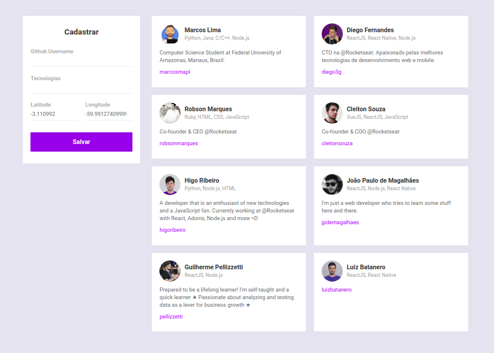
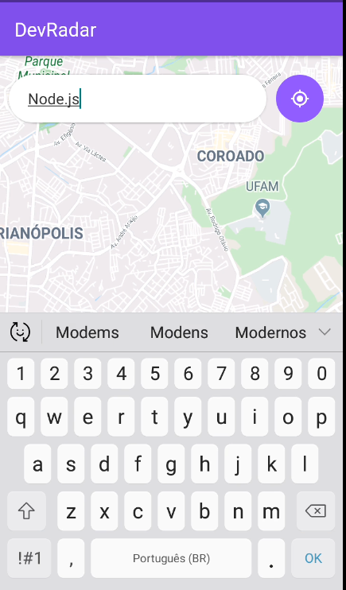
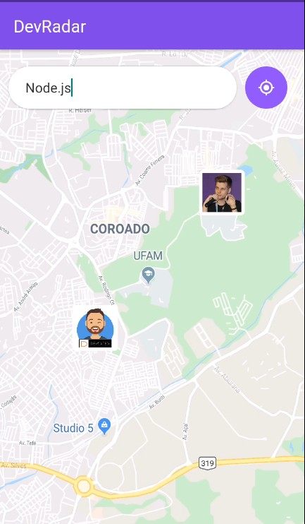
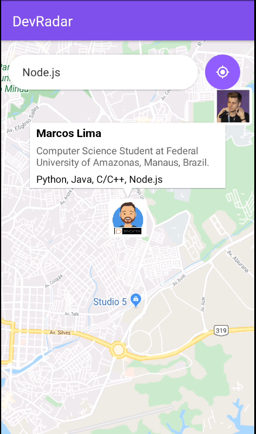
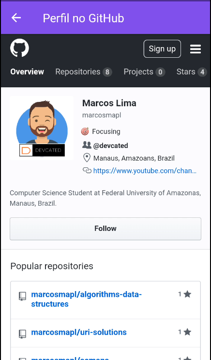

# Dev Radar

[![Contributors][contributors-shield]][contributors-url]
[![Forks][forks-shield]][forks-url]
[![Stargazers][stars-shield]][stars-url]
[![Issues][issues-shield]][issues-url]
[![MIT License][license-shield]][license-url]
[![LinkedIn][linkedin-shield]][linkedin-url]

> Tool for find Developers that are 10 KM near of a search area and use some required technologies.

> Keywords: `SemanaOmnistack`, `Rocketseat`, `Node.js`, `ReactJS`, `ReactNative`, `MongoDB`, `Express`, `Axios`, `Expo`, `Socket.io`, `Nodemon`, `Mongoose`, `CORS`

<!-- TABLE OF CONTENTS -->
## Table of Contents

* [About the Project](#about-the-project)
* [Built with](#built-with)
	* [Yarn](#yarn)
	* [Nodemon](#nodemon)
	* [Express](#express)
	* [Axios](#axios)
	* [CORS](#cors)
	* [Mongoose](#mongoose)
	* [Socket.io](#socket.io)
	* [Expo](#expo)
* [Realease History](#release-history)
* [Usage Example](#usage-example)
	* [Running Backend Project](#running-backend-project)
	* [Running Frontend Project](#running-frontend-project)
	* [Running Mobile App Project](#running-mobile-app-project)
* [Some Common Issues](#some-common-issues)
* [Roadmap](#roadmap)
* [Contributing](#contributing)
* [Contact](#contact)
* [License](#license)

## About The Project

This project was developed during the <strong>10th OmniStack Week</strong> promoted by <strong>Rocketseat</strong>, whose objective was to present the `Node.js`, `ReactJS` and `React Native` technologies, developing a complete application (Back-end, Front-end and Mobile) from zero.

The BackEnd project was built using `Node.js` and `Express`. It makes use of the `MongoDB` database through the `Mongoose` (data model objects). `Axios` was used for HTTP requests and `JSON` protocol is used for data trade. `GitHub API` is used for obtain some informations about the developer (Avatar, Bio, Name, Location). And for real-time communication between the Back-end and all clients, `Socket.io` was used.

The FrontEnd project is a web application made in `ReactJS`. It allows the registration of developers on the platform, informing his GitHub username, all technologies he uses and his latitude and longitude. Displays a list of all developers registered on the platform.



The Mobile App project was developed using `React Native`. `Expo` is used for build and deploy for `iOS` and `Android`. The mains screen is a map (Google Map) for choosing a initial location for search and a input field where the desired technologies must be inserted. After the search, all developers, within a radius of 10 km, who use any of the desired technologies, are displayed on the map.






## Built with

### `Yarn` 
Dependency Management tool (_v1.21.1_).

https://yarnpkg.com/lang/en/

### `Nodemon`
Monitor for any changes in our source and automatically restart our server (_v2.0.2_).

https://nodemon.io/

### `Express`
Minimalist Web Framework for Node.js (_v4.17.1_).

https://expressjs.com/

### `Axios`
Promise based HTTP client for the browser and Node.js (_v0.19.1_).

https://github.com/axios/axios.git

### `CORS`
Node.js package for providing a Connect/Express middleware that can be used to enable Cross-Origin Resource Sharing with various options (_v2.8.5_).

https://github.com/expressjs/cors

### `Mongoose`
MongoDB object modeling for Node.js (_v5.8.9_).

https://mongoosejs.com/

### `Socket.io`
Enables real-time bidirectional event-based communication (_v2.3.0_).

https://socket.io/

### `Expo`
An open-source platform for making universal native apps that run on Android, iOS, and the web (_v36.0.2_).

https://expo.io/

## Release History

* 0.0.1
    * Work in progress

## Usage example

### Running Backend Project

To run Backend application, navigate to `backend` folder and run the command:

```sh
yarn dev
```

and wait Nodemon puts application up.

### Running Frontend Project

To run Frontend web application, navigate to `web` folder and run the command:

```sh
yarn start
```

and wait until compilation ends. 

After it the web application will appears in a tab on your default web browser. Otherwise, open your browser and access `http://localhost:3333/`

### Running Mobile App Project

To run Mobile App we use `Expo`. First navigate to `mobile` folder and run the command:

```sh
yarn start
```

and wait until compilation ends. 

After it the web application will appears in a tab on your default web browser. Otherwise, open your browser and access `http://localhost:1900X/` (check Expo port in you prompt/terminal).


The mobile application can be run inside emulators (see the documentation [Expo](https://expo.io/learn)) or directly by cell phone through the Expo application.

Download Expo Application into your mobile, Run it and Press 'Scan QR Code':


Scan the `QR Code` displayed in the bottom left corner of your browser and wait until application load.


_For more examples and usage, please refer to the [Wiki][wiki] (under construction)._

## Some Common Issues

* Errors when Openning App into your Mobile Phone (Timeout, Package is Not Running...)
	* Try shutdown and starts Expo again
	* Try start Expo using `expo start`
	* Switch your connection method, try `Tunnel` or `Local`
	* Check if Mobile Phone have access to your Backend (may Firewall or Proxy blocking it)
		* With Back-end running, try get a list of all developers acessing `http://<your-ip>:3333/developers/`
* Rocketseat Expo Commom Issues
	* https://github.com/Rocketseat/expo-common-issues

## Roadmap

See the [open issues](https://github.com/marcosmapl/semana-oministack10/issues) for a list of proposed features (and known issues).

## Contributing

1. Fork it (<https://github.com/marcosmapl/semana-oministack10/>)
2. Create your feature branch (`git checkout -b feature/fooBar`)
3. Commit your changes (`git commit -am 'Add some fooBar'`)
4. Push to the branch (`git push origin feature/fooBar`)
5. Create a new Pull Request

<!-- Markdown link & img dfn's -->
[wiki]: https://github.com/marcosmapl/semana-oministack10/wiki
[linkedin-shield]: https://img.shields.io/badge/-LinkedIn-black.svg?style=flat-square&logo=linkedin&colorB=555
[linkedin-url]: https://linkedin.com/in/marcosmapl
[contributors-shield]: https://img.shields.io/github/contributors/othneildrew/Best-README-Template.svg?style=flat-square
[contributors-url]: https://github.com/marcosmapl/semana-oministack10/graphs/contributors
[forks-shield]: https://img.shields.io/github/forks/marcosmapl/semana-oministack10.svg?style=flat-square
[forks-url]: https://github.com/marcosmapl/semana-oministack10/network/members
[stars-shield]: https://img.shields.io/github/stars/marcosmapl/semana-oministack10.svg?style=flat-square
[stars-url]: https://github.com/marcosmapl/semana-oministack10/stargazers
[issues-shield]: https://img.shields.io/github/issues/marcosmapl/semana-oministack10.svg?style=flat-square
[issues-url]: https://github.com/marcosmapl/semana-oministack10/issues
[license-shield]: https://img.shields.io/github/license/marcosmapl/semana-oministack10.svg?style=flat-square
[license-url]: https://github.com/marcosmapl/semana-oministack10/blob/master/LICENSE.txt

## Contact

Marcos Lima  – marcos.lima@icomp.ufam.edu.br

[![LinkedIn][linkedin-shield]][linkedin-url]

[See my project on GitHub](https://github.com/marcosmapl/semana-oministack10/)

## License

[](http://badges.mit-license.org)

- **[MIT license](http://opensource.org/licenses/mit-license.php)**
- Copyright 2020 © <a href="https://www.linkedin.com/in/marcosmapl" target="_blank">marcosmapl</a>.

<!-- ACKNOWLEDGEMENTS -->
## Acknowledgements
* [Rocketseat](https://rocketseat.com.br/)
* [Diego Schell Fernandes](https://www.linkedin.com/in/diego-schell-fernandes/)
